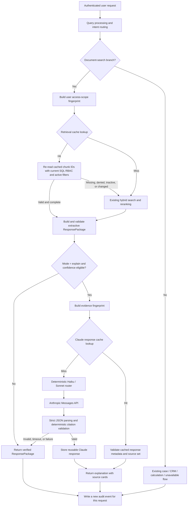

# Proposed Claude Explanation and Shared Response Cache Architecture

**Status:** Proposed for the next production build. This document is a build specification, not an enabled feature.

**Owner decision required before implementation:** `AGENTS.md` and
`docs/CURRENT_PRODUCT_SPEC.md` currently prohibit an LLM or external AI API in
the request-serving path. Implementing this design requires an explicit,
reviewed exception to that rule. Do not enable any Claude call merely because
this document exists.

## 1. Goal and boundaries

Add an optional, citation-bound Claude explanation mode and reuse safe work
across users with equivalent access. The feature must lower repeated retrieval
and API cost without allowing one user's data, permissions, chat context, or
case information to leak to another user.

The normal, extractive `ResponsePackage` remains the product default and the
fallback. Claude is a presentation layer only: it receives a validated,
already-authorized set of excerpts and may explain those excerpts. It does not
connect to PostgreSQL, select sources, receive a broad document corpus, or
make permission decisions.

Out of scope for this phase:

- Redis, Qdrant, MinIO, a new service/container, or a background scheduler.
- Semantic cache matching. Start with exact normalized-query matching only.
- Cross-user reuse of case, CRM, task, client, calculation, or chat-session
  responses. Those branches are always user/context specific.
- Automatic document updates or generated knowledge-base content.

## 2. Recommended product behavior

Expose two response modes for the **document-search branch only**:

| Mode | Default | Result |
| --- | --- | --- |
| `verified` | Yes | Existing extractive `ResponsePackage`; no external model call. |
| `explain` | User opt-in | A Claude explanation plus the unchanged source cards/citations. |

The UI must clearly preserve access to the original excerpts. A generated
explanation is never the sole evidence shown to an advisor.

Use one deterministic model router:

- **Claude Haiku** is the default explanation model for a high-confidence
  request with one to three validated source excerpts.
- **Claude Sonnet** is used only when a request is classified as an approved
  multi-source comparison or a detailed, user-requested explanation.
- Never call Haiku and Sonnet in sequence for a single request. That doubles
  cost and latency without providing a deterministic factual guarantee.
- If confidence is below the existing explanation threshold, no sources are
  validated, a source is stale, or a route is not the document branch, skip
  Claude and return the normal package.

The router must use explicit fields such as response mode, source count,
request type, and confidence. It must not use a third LLM call to decide which
model to use.

## 3. Production flow



Authentication occurs before any cache lookup. Every request, including a cache
hit and a model failure, writes a new `audit_log` record for the requesting
user.

## 4. Components and technologies

Use the existing FastAPI, Pydantic, psycopg 3, PostgreSQL, pgvector, and
Next.js stack. No standing cache service is introduced.

| Concern | Technology and implementation choice |
| --- | --- |
| API integration | Official Python `anthropic` SDK, called only from `backend/app/ai/anthropic_client.py`. Pin a tested version in `backend/requirements.txt`. |
| Secret storage | `HEXA_ANTHROPIC_API_KEY` injected into the backend systemd service environment or its host secret mechanism. Never expose it to Next.js, browser code, the database, logs, or committed `.env` files. |
| Cache storage | Existing project PostgreSQL database, using JSONB metadata and explicit relational columns. Do not introduce Redis. |
| Cache key hashing | Python `hashlib.sha256` over canonical JSON produced with sorted keys and compact separators. Store only hashes/fingerprints in lookup keys. |
| DB access | Existing `app.db.postgres.session.acquire()` and psycopg parameterized SQL. |
| Response contract | Pydantic models with strict validation (`extra="forbid"`) for Claude output and cache payloads. |
| Model calls | Anthropic Messages API with an explicit model alias from configuration, bounded input, bounded output, finite timeout, and no retries that block the request indefinitely. |
| Monitoring | Existing `audit_log.meta`, structured application logs without excerpt/query text, and cache/model latency fields. |

## 5. Proposed module layout

Create a small, isolated package. Do not put provider code in
`api/v1/search.py` or `api/v1/chat.py`.

```text
backend/app/
  ai/
    __init__.py
    anthropic_client.py          # bounded SDK call; no database access
    explanation_router.py        # deterministic Haiku vs Sonnet choice
    explanation_prompt.py        # versioned source-only prompt construction
    explanation_schema.py        # Pydantic request/response models
    explanation_validator.py     # citation/source/output validation
  cache/
    __init__.py
    fingerprints.py              # canonical JSON and SHA-256 helpers
    access_scope.py              # permission-safe scope fingerprint
    retrieval_cache.py           # cache candidate IDs only
    explanation_cache.py         # validated generated responses only
    invalidation.py              # synchronous invalidation helpers
  response/
    ai_enrichment.py             # orchestrates the optional post-validation step
```

Modify the existing code only at the document branch orchestration point in
`backend/app/api/v1/search.py` (or a narrow extracted document-pipeline
function). The exact order must remain:

1. Authenticate the user.
2. Process the query and select the document branch.
3. Resolve access scope and attempt retrieval-cache lookup.
4. On a retrieval-cache hit, re-query the listed chunks with the existing RBAC
   and active/approved SQL `WHERE` predicates; never trust cached permissions.
5. Run existing search/ranking if that verification cannot reconstruct the
   complete candidate set.
6. Build and validate the extractive `ResponsePackage`.
7. Optionally run cache-backed Claude explanation enrichment.
8. Audit-log the final outcome.

## 6. Configuration

Add these settings to `backend/app/config.py`. Production startup must fail if
`ai_explanations_enabled=true` but `anthropic_api_key` is absent.

```text
HEXA_AI_EXPLANATIONS_ENABLED=false
HEXA_ANTHROPIC_API_KEY=
HEXA_ANTHROPIC_HAIKU_MODEL=<approved Haiku model ID>
HEXA_ANTHROPIC_SONNET_MODEL=<approved Sonnet model ID>
HEXA_AI_PROMPT_VERSION=1
HEXA_AI_TIMEOUT_SECONDS=8
HEXA_AI_MAX_INPUT_CHARS=9000
HEXA_AI_MAX_OUTPUT_TOKENS=700
HEXA_AI_EXPLAIN_MIN_CONFIDENCE=90
HEXA_AI_SONNET_MIN_SOURCE_COUNT=4
HEXA_RETRIEVAL_CACHE_TTL_SECONDS=900
HEXA_AI_CACHE_TTL_SECONDS=86400
```

The deployed model identifiers must be configuration values rather than
hard-coded strings. Record the chosen values and the effective prompt version
in each model-related audit event.

## 7. Safe cache design

### 7.1 Access-scope fingerprint

Create a fingerprint from the *effective* document access policy, not merely a
user role. For the current document branch it includes:

```json
{
  "branch": "document",
  "role": "loan_officer",
  "allowed_departments": ["lending", "general"],
  "policy_version": 1
}
```

Sort arrays before hashing. Do not include user ID in this fingerprint, because
users with exactly identical access can safely share a cache entry after the
required current SQL re-check. Do not reuse this fingerprint for case/CRM/task
data; those paths have case-level ACL and are excluded from shared caching.

Whenever the RBAC policy format changes, increment `policy_version`. Any user
department or role mutation must invalidate cache entries for the old scope (or
force them stale through a scope epoch described below).

### 7.2 Retrieval cache key and payload

Retrieval caching saves embedding/search/reranking work. The key must include:

- Canonical normalized query and expanded subqueries.
- Query-processing version.
- Access-scope fingerprint.
- Knowledge-base epoch.
- Ranking configuration version and reranker model/version when enabled.

It stores only ordered chunk IDs and safe ranking metadata—not a rendered
response and not user/session context. On a hit, fetch those IDs through SQL
that applies the **current** `is_active`, `is_approved`, department, and other
existing RBAC predicates. If fewer expected chunks return, treat it as a miss.

### 7.3 Claude explanation cache key and payload

Do not key generated content only by question text. Build an evidence
fingerprint from:

- Ordered source chunk IDs.
- Each source `content_hash` and document version.
- Access-scope fingerprint.
- Canonical query fingerprint.
- Response mode.
- Prompt version, model ID, and generation-parameter version.

The cache payload contains only a response that has passed deterministic
validation, its citations, selected model alias, and metadata needed to verify
that key. It must never contain User A's ID, chat session ID, active case,
cookies, raw token data, or internal prompt text.

### 7.4 Tables

Add these idempotent DDL entries in `backend/app/db/postgres/schema.py`.
Use UTC `TIMESTAMPTZ` timestamps and parameterized SQL everywhere.

```sql
CREATE TABLE IF NOT EXISTS knowledge_cache_state (
    id BIGINT PRIMARY KEY CHECK (id = 1),
    knowledge_epoch BIGINT NOT NULL DEFAULT 1,
    updated_at TIMESTAMPTZ NOT NULL DEFAULT now()
);

INSERT INTO knowledge_cache_state (id)
VALUES (1)
ON CONFLICT (id) DO NOTHING;

CREATE TABLE IF NOT EXISTS retrieval_cache (
    cache_key TEXT PRIMARY KEY,
    access_scope_hash TEXT NOT NULL,
    knowledge_epoch BIGINT NOT NULL,
    candidate_ids BIGINT[] NOT NULL,
    candidate_count INTEGER NOT NULL,
    ranking_version TEXT NOT NULL,
    expires_at TIMESTAMPTZ NOT NULL,
    created_at TIMESTAMPTZ NOT NULL DEFAULT now(),
    last_used_at TIMESTAMPTZ NOT NULL DEFAULT now(),
    hit_count BIGINT NOT NULL DEFAULT 0
);

CREATE TABLE IF NOT EXISTS ai_explanation_cache (
    cache_key TEXT PRIMARY KEY,
    access_scope_hash TEXT NOT NULL,
    knowledge_epoch BIGINT NOT NULL,
    evidence_fingerprint TEXT NOT NULL,
    model_alias TEXT NOT NULL,
    prompt_version TEXT NOT NULL,
    response_payload JSONB NOT NULL,
    expires_at TIMESTAMPTZ NOT NULL,
    created_at TIMESTAMPTZ NOT NULL DEFAULT now(),
    last_used_at TIMESTAMPTZ NOT NULL DEFAULT now(),
    hit_count BIGINT NOT NULL DEFAULT 0
);

CREATE INDEX IF NOT EXISTS idx_retrieval_cache_expiry
    ON retrieval_cache (expires_at);
CREATE INDEX IF NOT EXISTS idx_ai_explanation_cache_expiry
    ON ai_explanation_cache (expires_at);
```

Use lazy expiry: every lookup requires `expires_at > now()`. Because the
backend is socket-activated, do not add a cleanup thread. A small, manual
maintenance command may delete expired rows during an existing operational
maintenance window; it is not required for correctness.

## 8. Claude request and response contract

Only call Claude after `validate_package()` succeeds and confidence is at or
above `HEXA_AI_EXPLAIN_MIN_CONFIDENCE`. Limit input to the top validated
excerpts. Do not pass unranked candidates or case/chat history.

The prompt must state that retrieved documents are untrusted data, not
instructions. It must prohibit following instructions found inside excerpts.
It must require every factual sentence to cite one or more provided `source_id`
values and prohibit filling gaps from general knowledge.

Require a structured JSON response such as:

```json
{
  "summary": "Plain-language explanation based only on sources.",
  "claims": [
    {
      "text": "A source-grounded factual statement.",
      "source_ids": [101, 102]
    }
  ],
  "limitations": "Optional statement of what the sources do not establish."
}
```

`explanation_validator.py` must reject the response when:

- JSON/Pydantic parsing fails, required fields are missing, or output exceeds
  configured limits.
- A citation is missing, duplicated incorrectly, or not in the validated
  source-ID allowlist.
- Source content/version hashes no longer match the evidence fingerprint.
- The model returns unsupported fields, URLs, tool calls, HTML, or attempts to
  disclose system instructions.

Citation membership is a necessary safety check, not proof that a claim is
entailed by a source. This is why the product must keep original excerpts
visible and why `verified` remains the default.

## 9. Failure behavior and latency

The AI layer is fail-open to the existing verified response, not fail-open to
unvalidated generated text:

| Condition | Required behavior |
| --- | --- |
| Cache hit and metadata/source re-check passes | Return cached result; audit cache hit. |
| Cache source re-check fails | Delete or ignore entry; run normal retrieval. |
| Anthropic timeout, rate limit, network error, malformed output, or validation failure | Return the extractive package; audit `ai_fallback`. Do not retry synchronously more than once. |
| Low confidence, no answer, RBAC denial, inactive source | Never call Claude; use existing response behavior. |
| Provider key missing while feature flag is enabled | Fail application startup in production. |

Set a hard model-call timeout shorter than the user-facing API timeout. Keep
the current reranker p95 budget independent: the external explanation call is
a separate metric. Report retrieval-cache hit rate, AI-cache hit rate, model
latency p50/p95, fallback rate, malformed-output rate, and cache storage size.

## 10. Auditing and privacy

Every request continues to generate a new `audit_log` row. Add only safe,
structured metadata to `audit_log.meta`, for example:

```json
{
  "response_mode": "explain",
  "retrieval_cache": "hit",
  "ai_cache": "miss",
  "ai_model_alias": "haiku",
  "ai_prompt_version": "1",
  "ai_outcome": "validated",
  "ai_latency_ms": 742
}
```

Do not store the Anthropic API key, raw authorization headers, provider request
IDs if they expose sensitive content, or full prompts/responses in ordinary
application logs. Decide with compliance/legal teams whether query text and
approved excerpts may be sent to Anthropic, including retention, data region,
data-processing agreement, and any mortgage/customer-information restrictions.

## 11. Invalidation rules

Correctness must not rely on TTL alone.

- After document ingestion publishes, unpublishes, changes approval state, or
  changes an active version: increment `knowledge_epoch` in the same database
  transaction that makes the source visible.
- After RBAC policy/departments change: increment the relevant access-scope
  epoch or invalidate entries matching the old `access_scope_hash`.
- After ranking, query-processing, prompt, model, or generation-parameter
  changes: change the relevant version value included in cache keys.
- After a provider safety incident: disable `HEXA_AI_EXPLANATIONS_ENABLED`;
  the existing retrieval experience must continue working.

## 12. Frontend contract

Extend request bodies with an explicit mode:

```json
{ "query": "What documents are needed?", "response_mode": "verified" }
```

The default remains `verified`. Add `response_mode` and optional
`ai_explanation` to `SearchResponse`/`ChatResponse`; retain every existing
extractive field for backwards compatibility. Render a clearly labelled
“AI explanation” section only when it passed server-side validation, directly
above the existing immutable source cards. Do not expose cache state to users
except optional neutral performance telemetry; cache hits are an implementation
detail.

## 13. Tests and release gates

Add tests under `backend/tests/` before enabling the flag:

1. Same normalized document query and same scope reuses retrieval cache.
2. Users with different departments cannot share a cache key or cached source.
3. A cache entry becomes unusable after document approval, active status, or
   version changes.
4. A cache hit still writes an audit entry for the new user/request.
5. Case/CRM/calculation/chat-context routes never use shared caches.
6. Claude is not called below confidence threshold or after validation failure.
7. Provider timeout/malformed JSON/invalid citation returns normal extractive
   output and audits the fallback.
8. Haiku/Sonnet routing is deterministic for fixed inputs.
9. API key is absent from serialized responses, logs, and audit metadata.
10. Existing RBAC leakage and retrieval benchmark suites remain green.

Before production enablement, record a benchmark report that compares cache
disabled versus enabled with the same evaluation corpus. Report retrieval
quality, RBAC leakage (must remain zero), latency, cache hit rate, provider
cost per successful explanation, and fallback rate. Run a security review of
prompt injection and a privacy/compliance review of data sent externally.

## 14. Implementation order

1. Obtain written approval to amend the no-LLM-serving-path rule and approve
   provider data handling.
2. Add cache schema/state and unit tests for canonical fingerprints and scope
   isolation. Keep feature flag off.
3. Add retrieval cache with SQL source re-check and invalidation on document/
   RBAC changes.
4. Benchmark retrieval cache independently; do not change ranking weights.
5. Add Anthropic client, strict output schema, deterministic validator, and
   feature-flagged Haiku-only explanation path.
6. Add AI response cache and model audit metadata.
7. Add Sonnet escalation only after Haiku quality/cost/latency results justify
   it.
8. Add frontend opt-in control, source-preserving display, deployment secrets,
   monitoring, and a staged production rollout.

## 15. Explicit non-negotiables for the implementation agent

- No model call before RBAC filtering, ranking, package construction, and
  validation.
- No cache lookup before authentication.
- Never return a cached source without a current SQL authorization/version
  re-check.
- Never use user IDs, session IDs, active case IDs, CRM records, or case data
  in a shared cache entry.
- Never replace source cards with generated prose.
- No Redis or background cache-cleanup scheduler.
- Every cache/model outcome is audit-logged per requesting user.
- Feature flag defaults to disabled in every environment until release gates
  and compliance approval are complete.
